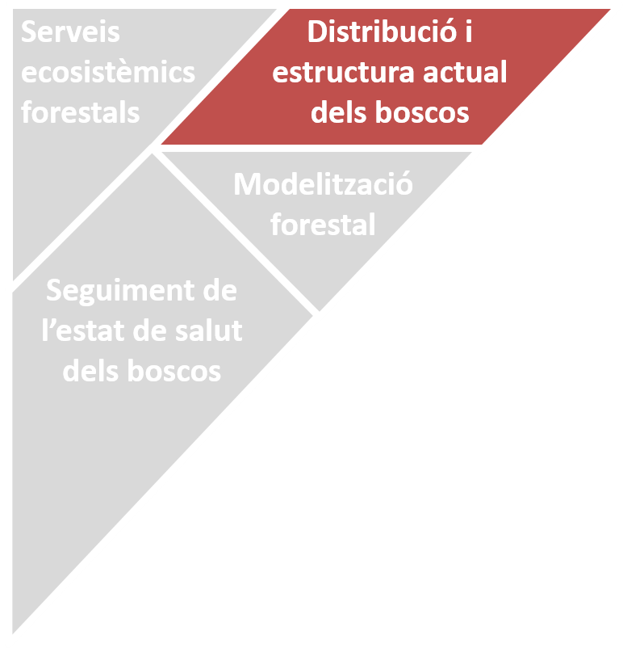
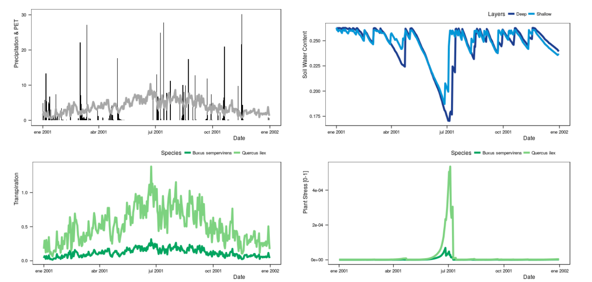
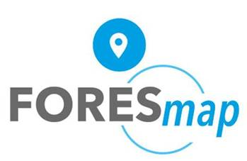
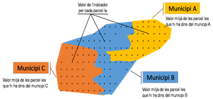
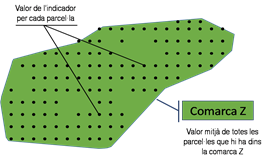
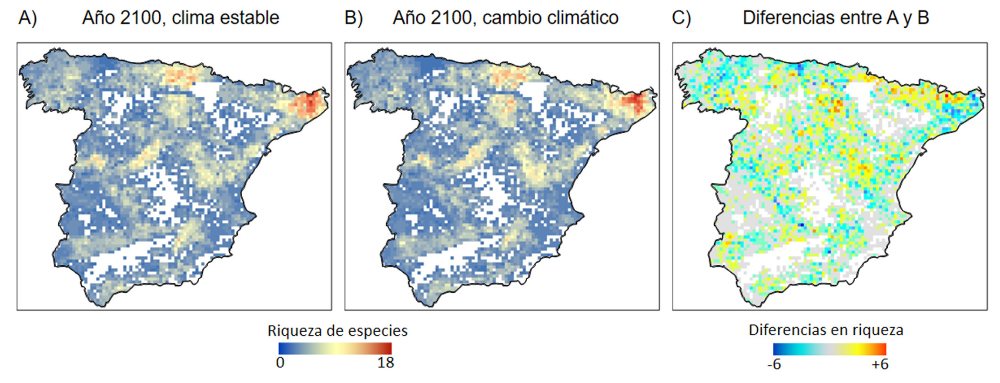
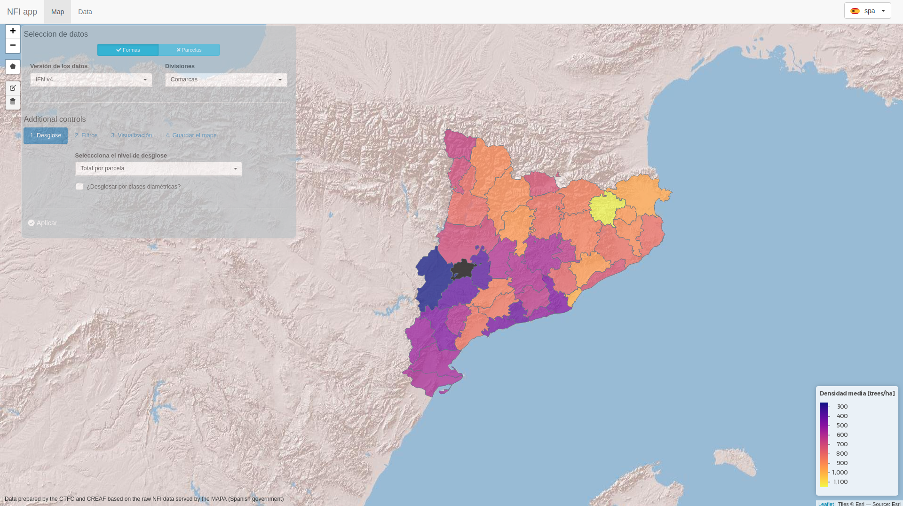
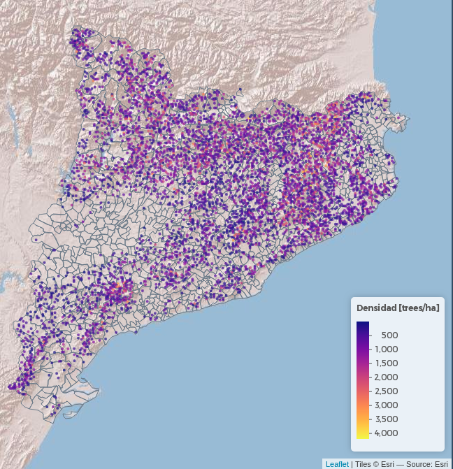
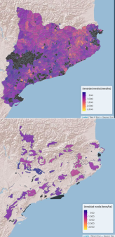

class: title-slide

# IFN app

## Consulta Interactiva del 2º, 3º y 4º Inventario Forestal Nacional en Cataluña

### Laboratori Forestal Catalá .font80[(2019-03-21)]

---

layout: true

<div class="tweaked-header" style="background-image: url(img/logos.svg)"></div>

<div class="my-footer" style="background-image: url(img/creaf_bar.png)"></div>

---

```{r setup, include=FALSE}
options(htmltools.dir.version = FALSE)
suppressPackageStartupMessages(library(tidyverse))
library(tidyNFI)
library(gt)

nfi_db <- nfi_connect()
```

# Inventarios Forestales Nacionales


  - **Segundo Inventario Forestal Nacional** (IFN2, `r tbl(nfi_db, 'PLOT_NFI_2_RESULTS') %>% collect() %>% nrow()` parcelas, realizado en 1990)  
  
  - **Tercer Inventario Forestal Nacional** (IFN3, `r tbl(nfi_db, 'PLOT_NFI_3_RESULTS') %>% collect() %>% nrow()` parcelas, realizado en 2000)  
  
  - **Cuarto Inventario Forestal Nacional** (IFN4, `r tbl(nfi_db, 'PLOT_NFI_4_RESULTS') %>% collect() %>% nrow()` parcelas, realizado en 2015)  
  
  
  

Hay
**`r tbl(nfi_db, 'PLOTS') %>% filter(presence_NFI_2, presence_NFI_3, presence_NFI_4) %>% collect() %>% nrow()`**
parcelas en común entre los tres inventarios,
**`r tbl(nfi_db, 'PLOTS') %>% filter(presence_NFI_2, presence_NFI_3) %>% collect() %>% nrow()`**
parcelas en común entre el IFN2 y el IFN3 y
**`r tbl(nfi_db, 'PLOTS') %>% filter(presence_NFI_3, presence_NFI_4) %>% collect() %>% nrow()`**
parcelas en común entre el IFN3 y el IFN4.


La repetición permite el cálculo de tasas:

  - pies supervivientes -> tasas de **crecimiento**
  - pies incorporados -> tasas de **reclutamiento**
  - pies aprovechados (desaparecidos) -> tasas de **explotación**
  - pies muertos -> tasas de **mortalidad**

---

layout: false
class: inverse

.font200[¿Que podemos hacer con estos datos?]

---
layout:true

<div class="tweaked-header" style="background-image: url(img/logos.svg)"></div>

<div class="my-footer" style="background-image: url(img/creaf_bar.png)"></div>

---

# `r icon::fa("seedling")` Pasado de nuestros bosques

.pull-extleft[
```{r puzzle, echo=FALSE, out.width="55%"}

```
]

.font120[

¿Ha habido cambios en la composición de los bosques?
  
¿Hay relación entre los cambios de uso y los cambios en los bosques?

]

.center[
```{r past, echo=FALSE, out.width="55%"}

```
]

---


# `r icon::fa("pagelines")` Presente de nuestros bosques

.pull-extleft[
```{r puzzle_2, echo=FALSE, out.width="55%"}

```

```{r servicios_eco_1, echo=FALSE, out.width="35%"}

```
]

.font120[

¿De qué servicios disponemos? 

¿Cuál es la vulnerabilidad actual a factores ambientales o plagas?
]

```{r servicios_eco_2, echo=FALSE, out.width="35%"}


```


---

# `r icon::fa("tree")` Futuro de nuestros bosques

.pull-extleft[
```{r puzzle_3, echo=FALSE, out.width="55%"}

```
]

.font120[

¿Qué especies se mantendrán en el futuro?

¿Como afectará el cambio global a los bosques, sus servicios y su conservación?

]

.center[
```{r future, echo=FALSE, out.width="75%"}

```
]

---

layout: false
class: inverse

.font200[IFN app]

---

layout: true

<div class="tweaked-header" style="background-image: url(img/logos.svg)"></div>

<div class="my-footer" style="background-image: url(img/creaf_bar.png)"></div>

---

# Conectarse a la aplicación

## http://ifnapp.creaf.cat

(Este enlace es temporal, cambiará en un futuro)



---

# Información disponible

## ¿Qué se puede consultar en la IFN app?

- IFN2, IFN3 e IFN4
  - Datos a nivel de parcela
  - Arbustos
  - Regeneración

- Comparación IFN2 vs IFN3
- Comparación IFN3 vs IFN4

.red[.center[.font160[
**Solo a nivel de Cataluña**
]]]


---

# Información disponible

## ¿A qué nivel de detalle?

.pull-left[
- Información a nivel de parcela

Se puede desglosar:
  - por Especie
  - por Especie simplificada
  - por Género
  - por Planifolias / Coníferas
  - por Caducifolias / Esclerófilas / Coníferas
  - y/o por clases diamétricas (7,5 a >70cm de 5 en 5 cm)
]

.pull-right[

]

---

# Información disponible

## Agregación

Los datos de las parcelas pueden agregarse para calcular estadísticos por unidades
administrativas o espacios protegidos

.pull-left[
**Unidades administrativas**

- Provincias
- Veguerias
- Comarcas
- Municipios

**Espacios protegidos**

- Espacios de interés natural
- Espacios de protección especial
- Red Natura 2000
]

.pull-right[.center[

]]


---
layout: false
class: inverse

.font200[Vamos a probar en directo]

---
class: thanks clear middle

# `r icon::fa("people-carry")` .font80[Concepto, diseño y programación:]

Víctor Granda (JRU CREAF-CTFC)  
Miquel de Cáceres (CTFC)  
Mireia Banqué (CREAF)  
Jordi Martínez (CREAF-UAB)  
Jordi Vayreda (JRU CREAF-CTFC)  

.center[
## `r icon::fa("hand-holding-usd")`

```{r logos_fin, echo=FALSE}

```

]

```{r, include=FALSE}
nfi_close(nfi_db)
```

